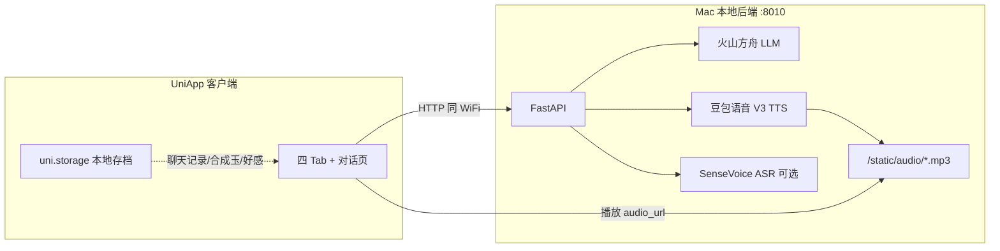

# 为斯卡蒂献上心脏 · AI 语音对话

面向《明日方舟》**斯卡蒂**与**浊心斯卡蒂**的角色扮演语音聊天实验项目：在 Mac 上运行本地网关（FastAPI），手机端用 UniApp 与之对话，由火山方舟生成台词、豆包声音复刻朗读，并带有罗德岛式 UI、好感度与商城赠礼剧情。

> 同人向个人作品，与鹰角网络及官方无关。

---

## 目录

- [项目能做什么](#项目能做什么)
- [系统架构](#系统架构)
- [环境要求](#环境要求)
- [从零开始：完整配置流程](#从零开始完整配置流程)
- [后端配置详解（backend/.env）](#后端配置详解backendenv)
- [前端与真机联网配置](#前端与真机联网配置)
- [运行与自测](#运行与自测)
- [App 使用说明](#app-使用说明)
- [对话与 TTS 文本规则](#对话与-tts-文本规则)
- [人设与商城数据](#人设与商城数据)
- [API 一览](#api-一览)
- [目录结构](#目录结构)
- [常见问题](#常见问题)
- [更多文档](#更多文档)
- [声明](#声明)

---

## 项目能做什么

### 核心对话

| 能力 | 说明 |
|------|------|
| 文字对话 | 输入文字 → LLM 按人设回复 → 可选 TTS 播放 |
| 语音对话 | 按住说话 → SenseVoice ASR → LLM → TTS 一键返回音频 URL |
| 双角色 | `skadi`（主线蓝蒂）、`skadi_corrupting`（浊心），各自头像、音色、system prompt |
| 语气与旁白 | LLM 用 `<cot text="…">对白</cot>` 控制朗读语气；全角 `（…）` 为不可念旁白，显示在气泡下方 |
| 好感 / 愉悦 | 回复中带 `mood_delta`；本地累计 `joy`、`affection`，影响 LLM 上下文 |
| 红包 | 满足条件时 LLM 可触发 `red_packet_offer`，客户端展示领取（+合成玉） |

### 罗德岛 UI（四个 Tab）

| Tab | 功能 |
|-----|------|
| 通信 | 微信式会话列表，进入与斯卡蒂 / 浊心的聊天页 |
| 干员 | 干员名单，查看关系与切换对话对象 |
| 商城 | 用合成玉购买道具并**赠送**，触发后端赠礼事件（LLM + TTS） |
| 我 | 博士状态、合成玉、特殊物品、**后端地址设置** |

### 赠礼事件（示例）

在商城购买并赠送特定道具后，调用 `POST /v1/gift/trigger`，由后端生成剧情台词并合成语音，例如：

- **盐风城** — 回忆向剧情
- **幽蓝潮声** — 哼唱类（需 TTS 与 cot 配置正确）
- **大海之眠** — 安眠向剧情

道具与人设绑定关系见 `backend/data/game_catalog.json`。

---

## 系统架构



**数据存放原则**

- **不入 Git**：API Key、`backend/.env`、`uniapp/config/server.local.js`、DCloud 离线 Key
- **仓库内 JSON**：人设、商城目录、博士状态模板（无密钥）
- **仅手机本地**：聊天记录、合成玉、好感度、已购道具等（`uni.storage`）

---

## 环境要求

| 项目 | 要求 |
|------|------|
| 开发机 | macOS 12+，Python 3.10 / **3.11 推荐** |
| 手机调试 | Android / iOS 真机或模拟器，与 Mac **同一 WiFi** |
| 前端 IDE | [HBuilderX](https://www.dcloud.io/hbuilderx.html)（打开 `uniapp/` 目录） |
| 云服务账号 | [火山方舟](https://console.volcengine.com/ark)（LLM）+ [豆包语音](https://console.volcengine.com/speech)（TTS 复刻音色） |
| 磁盘 | 约 4GB（若开启 SenseVoice，首次会下载模型） |
| 可选 | DCloud 开发者账号（云打包 / 自定义调试基座） |

默认后端端口 **8010**（避免与 HBuilderX 内置服务占用 8000/8001）。

---

## 从零开始：完整配置流程

### 步骤 0：克隆仓库

```bash
git clone https://github.com/MAX520dd/MAX520dd.github.io.git
cd MAX520dd.github.io   # 或你的本地目录名 ai-voice-chat
```

### 步骤 1：生成本地配置文件（不入库）

```bash
chmod +x scripts/setup-local-config.sh start-backend.sh backend/run.sh backend/install-deps.sh
./scripts/setup-local-config.sh
```

将创建（若不存在）：

- `backend/.env` ← 从 `backend/.env.example` 复制
- `uniapp/config/server.local.js` ← 从 `uniapp/config/server.example.js` 复制

### 步骤 2：申请并填写火山方舟（LLM）

1. 打开 [火山方舟控制台](https://console.volcengine.com/ark)
2. **API Key 管理** → 创建密钥 → 填入 `.env` 的 `ARK_API_KEY` 或 `LLM_API_KEY`
3. **在线推理** → **创建推理接入点** → 选择模型（推荐 Doubao-Seed-1.6 / 1.5-Pro；省钱可用 Flash / Lite）
4. **不要**选带 **Thinking** 的模型
5. 复制接入点 ID（`ep-xxxxxxxxxx-xxxxx`）→ 填入 `LLM_MODEL`

### 步骤 3：申请并填写豆包语音（TTS）

1. 打开 [语音技术控制台](https://console.volcengine.com/speech) → **API Key 管理**
2. 创建 API Key → 填入 `DOUBAO_API_KEY`
3. 在控制台完成**声音复刻**，获得音色 ID（`S_` 开头）
4. 本项目默认音色（可在 `backend/data/personas.json` 修改）：

   | 角色 | `default_voice` |
   |------|-----------------|
   | 斯卡蒂 | `S_RUcfpOs32` |
   | 浊心斯卡蒂 | `S_SUcfpOs32` |

5. 复刻为 **ICL 2.0** 时保持：

   ```env
   DOUBAO_CLONE_RESOURCE_ID=seed-icl-2.0
   DOUBAO_USE_TAG_PARSER=true
   DOUBAO_TTS_MODEL=seed-tts-2.0-expressive
   ```

   详见 [docs/doubao-tts-setup.md](docs/doubao-tts-setup.md)。

### 步骤 4：填写局域网地址（真机必做）

在 Mac 终端查看 WiFi IP：

```bash
ipconfig getifaddr en0
# 若无输出可试 en1
```

假设得到 `192.168.1.100`，则同时修改两处（**必须一致**）：

**`backend/.env`**

```env
PUBLIC_BASE_URL=http://192.168.1.100:8010
HOST=0.0.0.0
PORT=8010
```

**`uniapp/config/server.local.js`**

```javascript
export const AUTO_SERVER_URL = 'http://192.168.1.100:8010'
```

> `PUBLIC_BASE_URL` 用于 TTS 返回的 `audio_url`；若仍写 `127.0.0.1`，手机能连上聊天接口但**播不了语音**。

### 步骤 5：安装 Python 依赖并启动后端

```bash
cd backend
python3 -m venv .venv
source .venv/bin/activate
pip install -r requirements.txt
cd ..
./start-backend.sh
```

浏览器打开：http://127.0.0.1:8010/health  

期望：`"llm_configured": true`, `"tts_configured": true`  

可选实测 TTS 鉴权：http://127.0.0.1:8010/health?check_tts=true

若暂不装 ASR（省时间 / 无 GPU），在 `.env` 设：

```env
ASR_ENABLED=false
```

此时 App 仍可用**文字输入**对话。

### 步骤 6：HBuilderX 运行 App

1. 用 HBuilderX 打开 **`uniapp/`**（不是仓库根目录）
2. **运行 → 运行到手机或模拟器**
3. 真机：确认与 Mac 同 WiFi；首次可在 **我 → 设置** 中点「测试连接」
4. 进入 **通信** → 选择斯卡蒂或浊心 → 文字或按住说话

### 步骤 7（可选）：Android 自定义基座 / 离线 Key

- 云打包、自定义图标：见 [docs/pack-android-ios.md](docs/pack-android-ios.md)
- 离线打包 AppKey：复制 `uniapp/dcloud-android.local.properties.example` 为 `dcloud-android.local.properties` 并填入 Key，见 [docs/dcloud-android-appkey.md](docs/dcloud-android-appkey.md)

---

## 后端配置详解（`backend/.env`）

完整模板见 [`backend/.env.example`](backend/.env.example)。

### 火山方舟（人物对话）

| 变量 | 必填 | 说明 |
|------|------|------|
| `ARK_API_KEY` / `LLM_API_KEY` | 是 | 方舟 API 密钥，二选一即可 |
| `LLM_BASE_URL` | 是 | 默认 `https://ark.cn-beijing.volces.com/api/v3` |
| `LLM_MODEL` | 是 | 推理接入点 ID，`ep-xxx` |
| `LLM_TEMPERATURE` | 否 | 口语多样性，推荐 `0.9` |
| `LLM_MAX_TOKENS` | 否 | 限制回复长度，推荐 `256`（利于短句 TTS） |
| `LLM_TOP_P` | 否 | 推荐 `0.9` |

### 豆包语音（TTS）

| 变量 | 必填 | 说明 |
|------|------|------|
| `DOUBAO_API_KEY` | 是 | 控制台 API Key，请求头 `X-Api-Key` |
| `DOUBAO_VOICE_TYPE` | 否 | 全局默认音色；各角色以 `personas.json` 为准 |
| `DOUBAO_CLONE_RESOURCE_ID` | 复刻必填 | 与训练版本一致，ICL 2.0 填 `seed-icl-2.0` |
| `DOUBAO_USE_TAG_PARSER` | 否 | `true` 启用 `<cot text="…">` 情感解析 |
| `DOUBAO_TTS_MODEL` | 否 | 表现力版：`seed-tts-2.0-expressive` |
| `DOUBAO_RESOURCE_ID` | 否 | 常规模型资源 ID，默认 `seed-tts-2.0` |

### ASR（可选）

| 变量 | 说明 |
|------|------|
| `ASR_ENABLED` | `true` 启用 SenseVoice；`false` 仅用文字 |
| `ASR_MODEL` | 默认 `iic/SenseVoiceSmall` |

### 服务监听

| 变量 | 说明 |
|------|------|
| `HOST` | `0.0.0.0` 允许局域网访问 |
| `PORT` | 默认 `8010` |
| `PUBLIC_BASE_URL` | 手机可访问的完整根 URL，**含端口** |

---

## 前端与真机联网配置

### 配置文件关系

```
uniapp/config/server.example.js   ← 仓库模板（127.0.0.1:8010）
uniapp/config/server.local.js     ← 你的局域网 IP（gitignore）
uniapp/config/server.js           ← 优先读 local，否则 example
uniapp/utils/server-auto.js       ← App 启动时写入 uni.storage
```

### 三种方式指定后端地址（优先级从高到低）

1. **设置页手动填写** — `我` 相关入口 → 设置 → 服务器地址（存入 `uni.storage`）
2. **自动填入** — `server.local.js` 的 `AUTO_SERVER_URL`，启动时由 `server-auto.js` 应用
3. **模拟器** — 可用 `http://127.0.0.1:8010`（仅本机模拟器）

### 检查清单

- [ ] Mac 后端已启动，`/health` 正常
- [ ] `PUBLIC_BASE_URL` 与 App 中地址 **主机+端口一致**
- [ ] 手机与 Mac **同一 WiFi**，未用仅主机可用的访客网络
- [ ] macOS **防火墙** 未拦截 8010（系统设置 → 网络 → 防火墙）
- [ ] 设置页「测试连接」成功后再进聊天页

### 外出 / 远程调试（进阶）

- **Tailscale**：手机与 Mac 加入同一 Tailnet，用 Tailscale IP 替换局域网 IP
- **frp / ngrok**：映射 8010 到 HTTPS 域名，同步改 `PUBLIC_BASE_URL` 与 App 地址

---

## 运行与自测

### 启动后端

```bash
# 项目根目录
./start-backend.sh
```

或：

```bash
cd backend && source .venv/bin/activate && uvicorn main:app --host 0.0.0.0 --port 8010
```

### 命令行自测

```bash
BASE=http://127.0.0.1:8010

# 健康检查
curl "$BASE/health"

# 文本对话（斯卡蒂）
curl -s -X POST "$BASE/v1/chat" \
  -H "Content-Type: application/json" \
  -d '{"text":"博士，你好。","persona_id":"skadi","history":[]}'

# TTS
curl -s -X POST "$BASE/v1/tts" \
  -H "Content-Type: application/json" \
  -d '{"text":"<cot text=\"平静\">博士，我在这里。</cot>","emotion":"calm"}'

# 人设列表
curl "$BASE/v1/personas"

# 商城目录
curl "$BASE/v1/game/catalog"
```

---

## App 使用说明

1. **通信**：选择角色进入聊天；支持表情、模式切换（冷淡 / 脆弱等，依人设而定）
2. **按住说话**：走 `/v1/voice/chat`；失败时可改用键盘文字
3. **商城**：消耗合成玉购买道具 → 赠送 → 等待剧情与语音
4. **我**：查看合成玉、特殊物品、博士状态；修改服务器地址
5. **头像面板**：对话页可查看当前角色关系与好感相关信息

进度与货币保存在本机，换手机或清缓存会丢失，属预期行为。

---

## 对话与 TTS 文本规则

后端 `services/persona.py` 会统一处理 LLM 输出：

| 写法 | 聊天气泡 | TTS |
|------|----------|-----|
| `<cot text="开心">对白</cot>` | 显示「对白」；语气写入 stage | 按 cot 情感合成 |
| 全角 `（动作描写）` | 气泡下方旁白 `stage` | **不朗读** |
| `「」`、半角 `()` | 自动转为全角括号旁白 | 不朗读 |

编写或修改人设时，请保持与 `.cursor/skills/arknights-skadi-persona/` 中规范一致。

---

## 人设与商城数据

| 文件 | 用途 |
|------|------|
| `backend/data/personas.json` | 角色 id、system_prompt、音色、情绪、few_shot |
| `backend/data/game_catalog.json` | 商城道具、价格、赠礼 `item_id` 与事件类型 |
| `backend/data/doctor_states.json` | 博士状态选项（供 LLM 上下文） |

修改人设后**重启后端**即可生效；无需改前端即可切换 `persona_id`。

---

## API 一览

| 方法 | 路径 | 说明 |
|------|------|------|
| GET | `/health` | 服务状态；`?check_tts=true` 实测 TTS |
| GET | `/v1/personas` | 可用人设列表 |
| GET | `/v1/doctor-states` | 博士状态元数据 |
| GET | `/v1/game/catalog` | 商城与道具目录 |
| POST | `/v1/chat` | 文本对话（JSON） |
| POST | `/v1/tts` | 单独合成语音 |
| POST | `/v1/asr` | 上传音频 → 文本 |
| POST | `/v1/voice/chat` | ASR → LLM → TTS 一键 |
| POST | `/v1/gift/trigger` | 赠礼剧情 `{ persona_id, item_id }` |
| GET | `/static/audio/*.mp3` | TTS 生成的音频文件 |

---

## 目录结构

```
ai-voice-chat/
├── README.md                 # 本文件
├── start-backend.sh          # 根目录一键启动后端
├── scripts/
│   ├── setup-local-config.sh # 生成本地 .env 与 server.local.js
│   └── build-android-debug-base.sh
├── backend/
│   ├── .env.example          # 环境变量模板
│   ├── main.py               # FastAPI 入口
│   ├── config.py             # 读取 .env
│   ├── data/                 # personas / 商城 / 博士状态
│   ├── services/             # llm_client, tts_doubao, persona, gift_events…
│   └── static/audio/         # TTS 输出（运行时生成，mp3 不入库）
├── uniapp/
│   ├── manifest.json         # App 名称、AppID、图标
│   ├── config/               # server.example / server.local / server.js
│   ├── pages/                # 对话、Tab、设置
│   ├── utils/                # chat-store, game-store, server-auto…
│   └── static/               # 头像、Tab 图标、应用图标
├── docs/                     # 部署、TTS、打包专题文档
└── .cursor/skills/           # 斯卡蒂人设编写 Skill（可选）
```

---

## 常见问题

| 现象 | 可能原因 | 处理 |
|------|----------|------|
| App 连不上后端 | IP/端口错误、不同 WiFi、防火墙 | 对齐 `PUBLIC_BASE_URL`、设置页地址；`curl` 自测 `/health` |
| 有文字无声音 | `PUBLIC_BASE_URL` 仍是 127.0.0.1 | 改为 Mac 局域网 IP:8010 |
| `/health` 中 `tts_configured: false` | 未填 `DOUBAO_API_KEY` | 检查 `.env` |
| TTS 401 / InvalidModelType | Resource-Id 与复刻版本不匹配 | 对照 [doubao-tts-setup.md](docs/doubao-tts-setup.md)，勿把 2.0 音色配 1.0 资源 |
| 赠礼 400 / 503 | 道具与角色不匹配 / TTS 失败 | 看响应 `detail`；哼唱类需 TTS 与 cot 正常 |
| ASR 503 | SenseVoice 未装好 | `ASR_ENABLED=false` 或 `pip install -r requirements.txt` |
| 真机显示绿色 HBuilder | 用的是标准调试基座 | 制作并选用「自定义调试基座」，见打包文档 |
| 未配置 appkey | 离线/Android 原生 | 配置 `dcloud-android.local.properties` |

---

## 更多文档

| 文档 | 内容 |
|------|------|
| [docs/deploy-mac.md](docs/deploy-mac.md) | Mac 部署、内网与穿透补充 |
| [docs/doubao-tts-setup.md](docs/doubao-tts-setup.md) | TTS、cot、复刻 Resource-Id、官方文档索引 |
| [docs/doubao-tts-v3-http-chunked.md](docs/doubao-tts-v3-http-chunked.md) | V3 HTTP Chunked 单向接口知识库（[官方 1598757 §2](https://www.volcengine.com/docs/6561/1598757?lang=zh#_2-http-chunked格式接口说明)） |
| [docs/ark-inference-api.md](docs/ark-inference-api.md) | 方舟推理 API 说明 |
| [docs/pack-android-ios.md](docs/pack-android-ios.md) | HBuilderX 运行、自定义基座、云打包 |
| [docs/dcloud-appid.md](docs/dcloud-appid.md) | DCloud AppID 申请 |
| [docs/dcloud-android-appkey.md](docs/dcloud-android-appkey.md) | Android 离线 Key |
| [docs/android-offline-custom-base.md](docs/android-offline-custom-base.md) | Android 离线自定义基座 |
| [docs/arknights-world-setting.md](docs/arknights-world-setting.md) | 泰拉世界观校对参考（防 OOC；**不**注入每轮对话，参考 [维基百科](https://zh.wikipedia.org/wiki/明日方舟)） |
| [docs/knowledge/skadi-bwiki.md](docs/knowledge/skadi-bwiki.md) | 斯卡蒂（主线）人员档案知识库（[B站 Wiki](https://wiki.biligame.com/arknights/%E6%96%AF%E5%8D%A1%E8%92%82) 摘录） |
| [.cursor/skills/character-persona/wiki-extraction.md](.cursor/skills/character-persona/wiki-extraction.md) | 从官方 Wiki 抽取人设的规则（新建干员必读） |
| [docs/knowledge/skadi-corrupting-bwiki.md](docs/knowledge/skadi-corrupting-bwiki.md) | 浊心斯卡蒂人员档案知识库（[B站 Wiki](https://wiki.biligame.com/arknights/%E6%B5%8A%E5%BF%83%E6%96%AF%E5%8D%A1%E8%92%82) 摘录） |

---

## 声明与许可

- 本项目源码采用 [Apache License 2.0](LICENSE)（与 [MAX520dd/MAX520dd.github.io](https://github.com/MAX520dd/MAX520dd.github.io) 仓库一致）。
- 仅供学习与交流；请勿将 API Key、复刻音色用于未授权商用。
- 《明日方舟》角色、立绘、名称等版权归 **上海鹰角网络科技有限公司** 及其权利人所有；本仓库为同人向二次创作，不主张官方权利。
- 仓库：https://github.com/MAX520dd/MAX520dd.github.io
